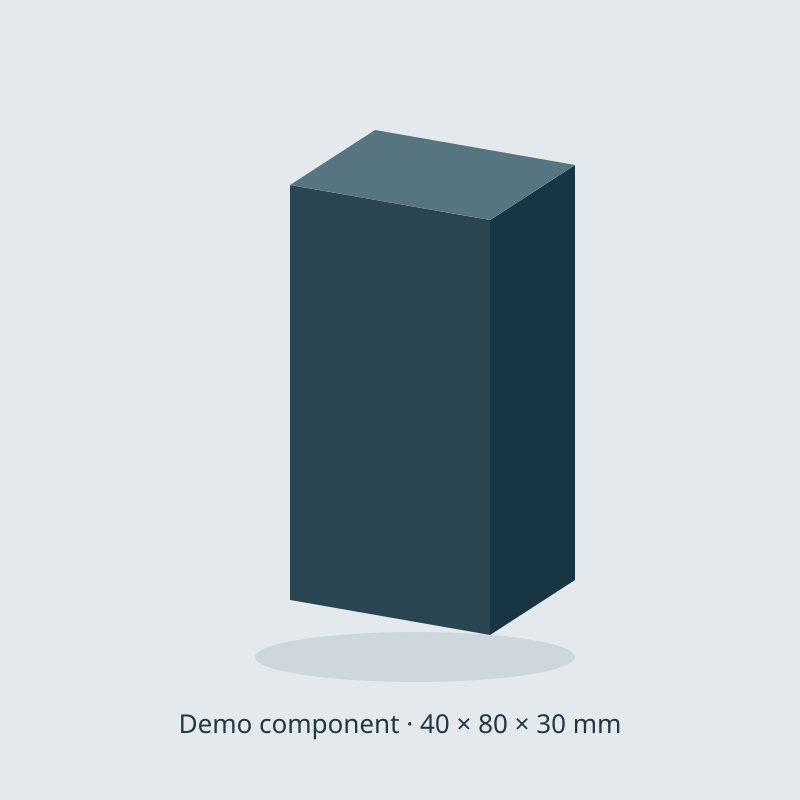

# Engiware

**Packaged engineering components and lightweight, expandable 3D previews for Obsidian.**

Keep component notes, manuals, scaled drawings, schematics, and models together.
Engiware imports a single `.engibook` package into ordinary vault files and shows
component images that expand into optional 3D views.



## Install

Requires **Obsidian 1.8.7 or later**.

### Community directory

Open **Settings → Community plugins → Browse**, search for **Engiware**, then
select **Install** and **Enable**. You can also open the
[Engiware listing](https://community.obsidian.md/plugins/engiware) and select
**Add to Obsidian**.

The listing is published under Green Pipe Partners LLC. Version 0.4.0 passed
Obsidian's automated review with no warnings or recommendations, verified
artifact attestations, and a byte-for-byte reproducible build.

New listings can take time to reach the in-app catalogue: Obsidian mirrors its
community directory to the app's catalogue on an hourly schedule. If Engiware
does not appear in Browse yet, fully quit and reopen Obsidian after the catalogue
sync to refresh the app's cached list.

### BRAT

In [BRAT](https://github.com/TfTHacker/obsidian42-brat), choose **Add beta plugin**
and enter:

```text
https://github.com/GreenPipePartners/obsidian-engiware
```

Then enable **Engiware** under **Settings → Community plugins**.

### Manual installation

Create `<vault>/.obsidian/plugins/engiware/` and download these three files from
the [latest release](https://github.com/GreenPipePartners/obsidian-engiware/releases/latest)
into that folder:

- [main.js](https://github.com/GreenPipePartners/obsidian-engiware/releases/latest/download/main.js)
- [manifest.json](https://github.com/GreenPipePartners/obsidian-engiware/releases/latest/download/manifest.json)
- [styles.css](https://github.com/GreenPipePartners/obsidian-engiware/releases/latest/download/styles.css)

Reload Obsidian and enable **Engiware**. All runtime dependencies are bundled.

## Try the demonstration

Download [GPP_Demo-Component_1.0.0.engibook](https://raw.githubusercontent.com/GreenPipePartners/obsidian-engiware/main/examples/GPP_Demo-Component_1.0.0.engibook),
then run **Engiware: Import .engibook** from the command palette and select it.
You can also copy an `.engibook` into a vault, open it, and choose **Deploy and open**.

The demo contains an original 40 × 80 × 30 mm model, a scaled SVG front view,
an illustrative contact schematic, a guide, and a preview image, all MIT-licensed.

## Component packages

Engibooks use **`{provider_code}_{part_number}_{engibook_version}.engibook`**.
Underscores separate the fields; hyphens within a part number are preserved.
For example, `AB_1606-XLE240E_1.0.0.engibook` uses `AB` for Allen-Bradley.

The content version is independent of the plugin version. All versions of that
part deploy to the stable ID **`AB_1606-XLE240E`**. The default layout is:

```text
EngiLib/
├── AB_1606-XLE240E.md
└── Assets/AB_1606-XLE240E/
    ├── schematic/
    ├── manuals/
    ├── 2d_scaled_component/
    ├── 3d_rendered/
    ├── asset-provenance.json
    └── engibook.json
```

Choose the folder under **Settings → Engiware → Deployment directory**.
It defaults to **`EngiLib`**; nested folders are supported, and an empty value
uses the vault root. The setting applies to subsequent imports. Asset links are
adjusted for the chosen location, including PDF anchors and the image/GLB paths.

The extracted note and assets work as native vault files. Obsidian can link,
index, edit, and sync them. PDF files open in the native viewer; editable
`.excalidraw.md` drawings use the separate Excalidraw community plugin.

Engiware validates the inventory and hashes before deployment. A **newer content
version replaces the files listed in its package, including local edits**.
Files absent from the new inventory stay in place. Identical packages can be
reimported without rewriting files; older versions and conflicting reuse of a
version number are rejected. Interrupted deployments can be resumed by importing
the package again. The installed version is committed after the assets and note.

New versioned packages use **format v2**, supported by Engiware **0.4.0+**.
Legacy v1 packages can still be imported. The archive is a snapshot; editing
extracted files does not rewrite it.

See [Engibook format and packaging](ENGIBOOK.md) to create your own packages.

## Expand an image into 3D

Add an `engiware` code block to a note:

````markdown
```engiware
model: EngiLib/Assets/GPP_Demo-Component/3d_rendered/model.glb
image: EngiLib/Assets/GPP_Demo-Component/3d_rendered/preview.svg
title: Demo component
height: 420
```
````

| Field | Meaning |
|---|---|
| `model` | Vault path to a self-contained GLB |
| `image` | Vault path to a preview image |
| `title` | Optional title; defaults to the model filename |
| `height` | Optional inline image height, 180–800 CSS pixels; default 420 |

Reading view and Live Preview display an ordinary image. Click **Expand**, or
focus the image and press Enter/Space, to initialize the optional viewer.
Drag to orbit, scroll or pinch to zoom, and right-drag to pan. **Reset view**
fits the camera to the model without changing its geometry, axes, or scale.

**Image**, **Esc**, or closing the modal releases its 3D resources.

If the normal graphics attempt fails, the expanded image stays visible with a
**Try 3D anyway?** confirmation. Choose **Keep Image**, or **Try 3D anyway** to
allow the browser's available WebGL 2 implementation, including software
rendering where supported. The retry uses reduced quality (640 px, up to 10 fps,
no antialiasing) and may be slow. No model is read or decoded while the confirmation
is open. The choice applies to that attempt; it does not change your saved settings.
If WebGL 2 is still unavailable, the image remains usable with an explanation.
No hardware-vendor configuration is required.

### Performance settings

Under **Settings → Engiware**:

- **Image-only mode:** expand images without initializing any 3D renderer.
- **3D render size:** cap the longest rendered edge at 640, 960, or 1280 pixels.
- **Interaction frame limit:** 10–30 fps, with 20 fps as the default.

On Obsidian 1.13 or later, these controls also appear in the global settings
search. Earlier supported versions render the same controls in Engiware's tab.

Views render on demand with no idle animation loop. Closing or switching to the
image cancels pending work and disposes graphics resources. The renderer lowers
resolution and the interaction frame limit after slow draws, and shows a warning
if they remain slow. It keeps the 3D view available until you switch back to the
image. Graphics errors or a lost WebGL context still return to the image.
GLBs must embed their resources; external texture downloads and external
compression decoders are not used.

## Privacy and file access

Engiware works offline, makes no network requests, and includes no telemetry,
accounts, payments, or advertisements. The import command reads the local
`.engibook` or `.zip` file you explicitly select, including a file outside the
vault. It writes extracted files only into the current vault through Obsidian's
public Vault API. Preview images and models are read from the vault.
During an import, Engiware checks the immediate children of the package's
destination folders and their parents for file/folder and case-insensitive name
collisions before writing any package contents. These checks are scoped to the
component's destination paths.

## Development and support

Development checks require Node.js 22.18+ and Python 3.10+ (the packager uses
only Python's standard library). Python is not needed to install or use the plugin.

```sh
npm ci
npm run verify
```

See [CONTRIBUTING.md](CONTRIBUTING.md) for development and release instructions.
Builds and tests are self-contained. Runtime checks have been performed on
Obsidian 1.13.7 for Linux, including graphics confirmation and retry, simulated
slow draws and no-WebGL image fallback, PDF/Excalidraw compatibility, configurable
deployment paths, versioned replacement, interrupted-upgrade resumption, import
conflicts, cancellation, and resource cleanup. Mobile
runtime testing is still pending; the plugin uses browser-compatible APIs.

Report bugs or request features in
[GitHub issues](https://github.com/GreenPipePartners/obsidian-engiware/issues).

## License

Copyright © 2026 Green Pipe Partners LLC. [MIT](LICENSE).
See [third-party notices](THIRD_PARTY_NOTICES.md) for Three.js and fflate attribution.
